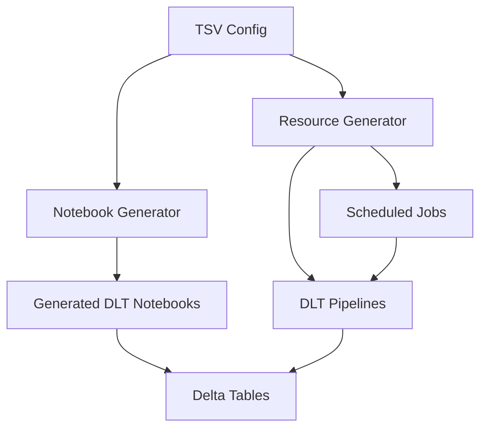

# Developer Guide

This guide is for developers who want to extend, modify, or contribute to the Azure Databricks Autoloader Framework.

## 🏗️ Architecture Overview

### Framework Components

```
autoloader-framework-pydab/
├── databricks.yml                           # Bundle configuration
├── resources/
│   ├── notebook_generator.py                # Static notebook generator
│   └── unified_pipeline_generator.py        # DLT pipeline generator
├── src/
│   └── notebooks/
│       └── generated/                       # Generated DLT notebooks
├── config/
│   └── unified_pipeline_config.tsv          # Pipeline definitions
└── sample_data/                             # Test data and examples
```

### Data Flow



## 🔧 Core Components

### 1. Notebook Generator (`resources/notebook_generator.py`)

**Purpose**: Generates static, DLT-compatible notebooks for each pipeline group.

**Key Methods**:
- `generate_pipeline_group_notebook()`: Creates unified notebook for a pipeline group
- `generate_bronze_table_notebook()`: Generates bronze ingestion logic
- `generate_silver_table_notebook()`: Generates silver SCD2 transformation logic

**Auto Loader Options Handling**:
The framework uses individual `.option()` calls to ensure proper case sensitivity and extensibility:

```python
# Individual .option() calls for each Auto Loader option
return (spark.readStream
        .format("cloudFiles")
        .option("cloudFiles.checkpointLocation", "/path/to/checkpoint")
        .option("cloudFiles.maxFilesPerTrigger", "1")
        .option("cloudFiles.cleanSource", "MOVE")
        .option("cloudFiles.cleanSource.moveDestination", "/path/to/archive")
        .option("cloudFiles.rescuedDataColumn", "corrupt_data")
        .option("cloudFiles.validateOptions", "true")
        .option("header", "true")
        .option("cloudFiles.format", "csv")
        .schema(schema)  # Fixed schema enforcement
        .load("/source/path"))
```

**Benefits of Individual .option() Approach**:
- ✅ **Case Sensitivity**: Preserves exact option names from TSV configuration
- ✅ **Extensibility**: Automatically picks up any new Auto Loader options
- ✅ **Debugging**: Easy to read and troubleshoot individual options
- ✅ **No Hardcoding**: All options come directly from TSV configuration

**Schema Management**:
The framework supports three schema strategies:

1. **Fixed Schema** (Customer, Inventory demos):
   - Schema defined inline in TSV `pipeline_config` as JSON
   - Applied via `.schema(schema)` in Auto Loader chain
   - Provides data validation and corrupt data handling
   - Uses `cloudFiles.rescuedDataColumn` for mismatched data

2. **Schema Inference** (Transaction demo):
   - Uses `cloudFiles.inferSchema: true`
   - Auto Loader automatically detects schema from data
   - Flexible for varying data structures

3. **Schema Evolution** (Shipment demo):
   - Uses `cloudFiles.schemaEvolutionMode: rescue`
   - Handles dynamic schema changes
   - Captures new fields in rescued data column

### 2. Resource Generator (`resources/unified_pipeline_generator.py`)

**Purpose**: Generates Databricks resources (pipelines, jobs) from configuration.

**Key Classes**:
- `UnifiedPipelineGenerator`: Main resource generation logic
- `Pipeline`: DLT pipeline definitions
- `Job`: Scheduled job definitions with pipeline tasks

**Key Methods**:
- `generate_resources()`: Main entry point
- `create_unified_pipeline()`: DLT pipeline creation
- `create_scheduled_job()`: Scheduled job creation with cron schedules

### 3. Configuration Management

**TSV Configuration Schema**:
```python
# Add new configuration columns
def validate_custom_column(self, df: pd.DataFrame) -> List[str]:
    errors = []
    if 'custom_field' in df.columns:
        # Validate custom field logic
        pass
    return errors

# Add new pipeline configuration options
def parse_custom_pipeline_config(self, config_json: str) -> dict:
    """Parse custom pipeline configuration options."""
    try:
        config = json.loads(config_json)
        # Add custom parsing logic
        return config
    except json.JSONDecodeError:
        return {}
```

## 🔄 Silver-Only Pipeline Support

The framework is designed to support **silver-only pipelines** for existing bronze tables, providing flexibility for various deployment scenarios.

### Use Cases

- **Legacy Data Migration**: Transform existing bronze tables to SCD2
- **External ETL Integration**: Use tables created by other tools or frameworks
- **Incremental Adoption**: Start with silver-only, add bronze operations later
- **Hybrid Approach**: Mix framework-created and external bronze tables

### Implementation Details

#### Configuration
```tsv
# Silver-only pipeline configuration
silver	existing_customers_pipeline	table		vbdemos.adls_bronze.customers_existing	vbdemos.adls_silver.customers_scd2	time	0 0 6 * * ?	{"keys": ["customer_id"], "track_history_except_column_list": ["first_name", "last_name", "email"], "stored_as_scd_type": "2", "sequence_by": "update_ts"}	medium	{"on_success": true, "on_failure": true, "recipients": ["admin@company.com"]}
```

#### Resource Generation
The framework automatically detects pipeline groups with only silver operations and creates appropriate resources:

```python
def create_unified_pipeline(self, pipeline_group: str, group_rows: List[dict]) -> Pipeline:
    """Create pipeline for pipeline group (bronze + silver or silver-only)."""
    
    # Check if this is a silver-only pipeline group
    silver_only = all(row.get('operation_type') == 'silver' for row in group_rows)
    
    if silver_only:
        print(f"   🔄 Creating silver-only pipeline for: {pipeline_group}")
        # Generate silver-only notebook
        notebook_path = f"src/notebooks/generated/unified_{pipeline_group}.py"
        # ... silver-only logic
    else:
        print(f"   🔄 Creating unified pipeline for: {pipeline_group}")
        # Generate bronze + silver notebook
        # ... unified logic
```

#### Notebook Generation
Silver-only pipelines generate notebooks that read from existing bronze tables:

```python
# Generated notebook for silver-only pipeline
@dlt.table(
    name="customers_scd2",
    table_properties={
        "quality": "silver",
        "operation": "existing_customers_pipeline",
        "pipelines.autoOptimize.optimizeWrite": "true"
    }
)
def customers_scd2():
    # Read from existing bronze table (not created by this framework)
    return dlt.read("bronze_customers_existing_source")
```

### Benefits for Developers

1. **Flexible Architecture**: Support for various deployment patterns
2. **Incremental Development**: Can start with silver-only and expand later
3. **Integration Friendly**: Works with existing data infrastructure
4. **Consistent Patterns**: Same SCD2 logic regardless of bronze source

## 📧 Notification System

The framework automatically configures email notifications for scheduled jobs based on the TSV configuration.

### Implementation

#### Notification Parsing
```python
def _get_notification_config_for_group(self, pipeline_group: str, group_rows: List[dict]) -> JobEmailNotifications:
    """Get notification configuration from the TSV config for a pipeline group."""
    
    # Look for the silver operation to get the notification config
    for row in group_rows:
        if row.get('operation_type') == 'silver':
            notifications = row.get('notifications', '')
            if notifications and pd.notna(notifications):
                try:
                    notification_data = json.loads(notifications)
                    
                    # Create JobEmailNotifications object
                    recipients = notification_data.get('recipients', [])
                    email_notifications = JobEmailNotifications(
                        on_success=recipients if notification_data.get('on_success', False) else [],
                        on_failure=recipients if notification_data.get('on_failure', True) else []
                    )
                    
                    return email_notifications
                    
                except (json.JSONDecodeError, TypeError) as e:
                    print(f"Error parsing notification config: {e}")
                    break
    
    return None
```

#### Job Integration
```python
def create_scheduled_job(self, pipeline_group: str, pipeline: Pipeline, group_rows: List[dict]) -> Job:
    # ... existing job creation code ...
    
    # Apply notification configuration if specified
    notification_config = self._get_notification_config_for_group(pipeline_group, group_rows)
    if notification_config:
        job.email_notifications = notification_config
        print(f"Applied notifications: {notification_config}")
    
    return job
```

### Configuration Format

The `notifications` column in the TSV uses JSON format:

```json
{
  "on_success": true,
  "on_failure": true,
  "recipients": ["admin@company.com", "data-team@company.com"]
}
```

**Parameters:**
- **`on_success`**: Boolean - send email on successful completion
- **`on_failure`**: Boolean - send email on failure (defaults to true)
- **`recipients`**: Array of email addresses to notify

**Databricks Integration:**
- Notifications are applied to the scheduled job, not the pipeline
- Uses `JobEmailNotifications` class from Databricks Asset Bundles
- Supports all Databricks notification types (success, failure, start, etc.)

**Extension Points**:
```python
# Add new file format support
def generate_custom_format_notebook(self, op_name, op_config, notebook_path):
    """Generate notebook for custom file format."""
    # Add your custom format logic
    pass

# Add new table properties
def add_custom_table_properties(self, table_properties):
    """Add custom table properties to generated notebooks."""
    table_properties.update({
        "custom.property": "value"
    })
```

### 2. Resource Generator (`resources/unified_pipeline_generator.py`)

**Purpose**: Generates Databricks resources (pipelines, jobs) from configuration.

**Key Classes**:
- `UnifiedPipelineGenerator`: Main resource generation logic
- `Pipeline`: DLT pipeline definitions
- `Job`: Scheduled job definitions with pipeline tasks

**Key Methods**:
- `generate_resources()`: Main entry point
- `create_unified_pipeline()`: DLT pipeline creation
- `create_scheduled_job()`: Scheduled job creation with cron schedules

**Extension Examples**:

#### Adding New Resource Types
```python
def create_custom_resource(self, pipeline_group: str, group_rows: List[dict]) -> CustomResource:
    """Create a custom resource type."""
    return CustomResource(
        name=f"custom_{pipeline_group}",
        configuration=self._build_custom_config(group_rows),
        # Add your custom resource properties
    )
```

#### Adding New Cluster Configurations
```python
def _get_cluster_config(self, cluster_size: str, cluster_config: str) -> dict:
    """Generate cluster configuration with new sizes."""
    if cluster_size == "xlarge":
        cluster_settings.update({
            "node_type_id": "Standard_D16s_v5",
            "autoscale": {
                "min_workers": 4,
                "max_workers": 16
            }
        })
    return cluster_settings
```

### 3. Configuration Management

**TSV Configuration Schema**:
```python
# Add new configuration columns
def validate_custom_column(self, df: pd.DataFrame) -> List[str]:
    errors = []
    if 'custom_field' in df.columns:
        # Validate custom field logic
        pass
    return errors

# Add new pipeline configuration options
def parse_custom_pipeline_config(self, config_json: str) -> dict:
    """Parse custom pipeline configuration options."""
    try:
        config = json.loads(config_json)
        # Add custom parsing logic
        return config
    except json.JSONDecodeError:
        return {}
```

## 🚀 Development Workflow

### 1. Local Development

```bash
# Set up virtual environment
python -m venv .venv
source .venv/bin/activate  # On Windows: .venv\Scripts\activate

# Install dependencies
pip install -r requirements.txt

# Test notebook generation
python resources/notebook_generator.py

# Test resource generation
python -c "from resources.unified_pipeline_generator import UnifiedPipelineGenerator; print('Import successful')"
```

### 2. Testing Changes

```bash
# Test notebook generation
python resources/notebook_generator.py

# Validate generated notebooks
python -c "import ast; ast.parse(open('src/notebooks/generated/unified_customer_pipeline.py').read()); print('Syntax valid')"

# Test bundle deployment (dry run)
databricks bundle validate --profile dev
```

### 3. Adding New Features

#### New File Format Support
1. Update `notebook_generator.py` with format-specific logic
2. Add format validation in configuration parser
3. Update example configurations
4. Test with sample data

#### New Pipeline Configuration Options
1. Add new JSON fields to pipeline_config
2. Update resource generator to handle new options
3. Add validation logic
4. Update documentation

#### Adding New Auto Loader Options
1. Add new options to TSV configuration in `pipeline_config` column
2. The framework automatically picks up any option starting with `cloudFiles.` or format-specific options (`header`, `inferSchema`, `multiline`)
3. Options are automatically converted to individual `.option()` calls in generated notebooks
4. No code changes required in the framework - fully extensible

**Example**:
```tsv
# Add new Auto Loader options to TSV
{"cloudFiles.schemaLocation": "/path/schema", "cloudFiles.newOption": "value", "cloudFiles.anotherOption": "anotherValue"}
```

**Generated Code**:
```python
# Automatically generated individual .option() calls
.option("cloudFiles.schemaLocation", "/path/schema")
.option("cloudFiles.newOption", "value")
.option("cloudFiles.anotherOption", "anotherValue")
```

## 📋 Schema Definition Guide

### Fixed Schema Configuration

For pipelines requiring data validation and corrupt data handling, schemas are defined inline in the TSV configuration:

```json
{
  "schema": {
    "type": "struct",
    "fields": [
      {"name": "product_id", "type": "string", "nullable": false},
      {"name": "product_name", "type": "string", "nullable": true},
      {"name": "quantity_on_hand", "type": "integer", "nullable": true},
      {"name": "unit_price", "type": "double", "nullable": true},
      {"name": "last_restocked", "type": "date", "nullable": true}
    ]
  }
}
```

### Schema Definition Best Practices

1. **Field Naming**: Use descriptive, consistent field names (snake_case recommended)
2. **Data Types**: Choose appropriate PySpark types (`string`, `integer`, `double`, `date`, `timestamp`)
3. **Nullable Fields**: Set `nullable: false` for required fields, `true` for optional fields
4. **Type Safety**: Fixed schemas provide compile-time validation and prevent data quality issues
5. **Corrupt Data Handling**: Use `cloudFiles.rescuedDataColumn` to capture mismatched data

### Supported Data Types

| JSON Type | PySpark Type | Description | Example |
|-----------|--------------|-------------|---------|
| `string` | StringType | Text data | `"product_name"` |
| `integer` | IntegerType | Whole numbers | `123` |
| `long` | LongType | Large integers | `1234567890` |
| `double` | DoubleType | Decimal numbers | `99.99` |
| `float` | FloatType | Single precision decimals | `99.9` |
| `boolean` | BooleanType | True/false values | `true` |
| `date` | DateType | Date values | `"2024-01-15"` |
| `timestamp` | TimestampType | Date and time values | `"2024-01-15 10:30:00"` |

### Schema Validation Features

- **Type Validation**: Ensures data matches expected types
- **Nullability Enforcement**: Validates required vs optional fields
- **Corrupt Data Rescue**: Captures data that doesn't match schema in `rescuedDataColumn`
- **Data Quality**: Prevents downstream processing issues

## 🔧 Configuration Extensions

### Auto Loader Options Implementation

The framework implements a robust system for handling Auto Loader options that ensures case sensitivity and extensibility:

#### Option Detection Logic
```python
# Build autoloader options from config - only include options that are specified
autoloader_options = {}

# Add all options from the config that start with cloudFiles. or are format-specific
for key, value in op_config.items():
    if key.startswith("cloudFiles.") or key in ["header", "inferSchema", "multiline"]:
        autoloader_options[key] = value
```

#### Individual Option Generation
```python
# Generate individual .option() calls for each autoloader option
option_lines = []
for key, value in autoloader_options.items():
    option_lines.append(f'            .option("{key}", "{value}")')

options_code = '\n'.join(option_lines) if option_lines else ''
```

#### Template Integration
```python
# Embed options in notebook template with proper formatting
return (spark.readStream
        .format("cloudFiles"){f'''
{options_code}''' if options_code else ''}
        .option("cloudFiles.format", "{file_format}")
        .load("{source_path}"))
```

#### Supported Option Types
- **CloudFiles Options**: Any option starting with `cloudFiles.`
- **Format Options**: `header`, `inferSchema`, `multiline`
- **Custom Options**: Automatically detected and included

### Custom Pipeline Properties

```python
# Add custom pipeline properties
def add_custom_pipeline_properties(self, unified_config: dict, group_rows: List[dict]):
    """Add custom properties to pipeline configuration."""
    for row in group_rows:
        if row.get('operation_type') == 'silver':
            custom_config = json.loads(row.get('custom_config', '{}'))
            for key, value in custom_config.items():
                unified_config[f"custom.{key}"] = str(value)
```

### Custom Job Scheduling

```python
# Add custom scheduling logic
def create_custom_scheduled_job(self, pipeline_group: str, pipeline: Pipeline, schedule_config: dict) -> Job:
    """Create job with custom scheduling logic."""
    if schedule_config.get('type') == 'custom':
        # Implement custom scheduling logic
        schedule = self._create_custom_schedule(schedule_config)
    else:
        schedule = CronSchedule(quartz_cron_expression=schedule_config['cron'])
    
    return Job(
        name=f"custom_{pipeline_group}_job",
        tasks=[Task(task_key="custom_task", pipeline_task=PipelineTask(pipeline_id=pipeline.name))],
        schedule=schedule
    )
```

## 🧪 Testing

### Unit Tests

```python
# Test notebook generation
def test_notebook_generation():
    generator = NotebookGenerator()
    generator.generate_all_notebooks()
    
    # Verify notebooks were created
    assert os.path.exists("src/notebooks/generated/unified_customer_pipeline.py")
    assert os.path.exists("src/notebooks/generated/unified_product_pipeline.py")

# Test resource generation
def test_resource_generation():
    bundle = MockBundle()
    generator = UnifiedPipelineGenerator(bundle)
    pipelines, jobs = generator.generate_resources()
    
    assert len(pipelines) == 4  # customer, order, order_items, product
    assert len(jobs) == 4
```

### Integration Tests

```bash
# Test complete workflow
python resources/notebook_generator.py
python -c "from resources.unified_pipeline_generator import UnifiedPipelineGenerator; print('✅ All imports successful')"
databricks bundle validate --profile dev
```

## 📚 Best Practices

### Code Organization
- Keep notebook generation logic separate from resource generation
- Use consistent naming conventions for pipeline groups
- Implement proper error handling and logging
- Add comprehensive validation for configuration files

### Performance Considerations
- Generate notebooks once, not on every deployment
- Use resource references for pipeline dependencies
- Implement proper cleanup for temporary resources
- Cache configuration parsing results

### Security
- Validate all configuration inputs
- Sanitize file paths and table names
- Use proper authentication for Databricks connections
- Implement least-privilege access controls

## 🔍 Debugging

### Common Issues

1. **Import Errors**: Check virtual environment and dependencies
2. **Configuration Errors**: Validate TSV format and JSON syntax
3. **Deployment Errors**: Check Databricks profile and permissions
4. **Scheduling Issues**: Verify Quartz cron syntax
5. **Auto Loader Option Validation Errors**: Case sensitivity issues with option names

### Auto Loader Option Validation Issues

**Problem**: `STREAM_FAILED` errors with "Found unknown option keys" when `cloudFiles.validateOptions` is `true`.

**Root Cause**: JSON embedding in f-strings can cause case conversion and double-encoding issues.

**Solution**: The framework uses individual `.option()` calls instead of JSON embedding:

```python
# ❌ Problematic approach (causes case conversion)
.options(**{"cloudFiles.cleanSource": "MOVE"})

# ✅ Fixed approach (preserves case sensitivity)
.option("cloudFiles.cleanSource", "MOVE")
```

**Implementation Details**:
```python
# Generate individual .option() calls for each autoloader option
option_lines = []
for key, value in autoloader_options.items():
    option_lines.append(f'            .option("{key}", "{value}")')

options_code = '\n'.join(option_lines) if option_lines else ''

# Embed in notebook template
return (spark.readStream
        .format("cloudFiles"){f'''
{options_code}''' if options_code else ''}
        .option("cloudFiles.format", "{file_format}")
        .load("{source_path}"))
```

**Verification**:
- Check generated notebooks for proper case sensitivity
- Ensure all TSV options are included as individual `.option()` calls
- Validate with `cloudFiles.validateOptions: true` enabled

### Debug Commands

```bash
# Check configuration parsing
python -c "import pandas as pd; df = pd.read_csv('config/unified_pipeline_config.tsv', sep='\t'); print(df.head())"

# Validate JSON configuration
python -c "import json; json.loads('{\"test\": \"value\"}'); print('JSON valid')"

# Test resource generation step by step
python -c "from resources.unified_pipeline_generator import UnifiedPipelineGenerator; print('Generator imported successfully')"
```

## 📖 Additional Resources

- [Databricks Asset Bundles Documentation](https://docs.databricks.com/dev-tools/bundles/)
- [Delta Live Tables Developer Guide](https://docs.databricks.com/data-engineering/delta-live-tables/)
- [Auto Loader Configuration Options](https://docs.databricks.com/ingestion/auto-loader/options.html)
- [Unity Catalog Development](https://docs.databricks.com/data-governance/unity-catalog/)

## 🤝 Contributing

1. **Fork** the repository
2. **Create** a feature branch (`git checkout -b feature/amazing-feature`)
3. **Commit** your changes (`git commit -m 'Add amazing feature'`)
4. **Push** to the branch (`git push origin feature/amazing-feature`)
5. **Open** a Pull Request

### Code Standards
- Follow PEP 8 Python style guidelines
- Add comprehensive docstrings for all functions
- Include error handling and validation
- Write tests for new functionality
- Update documentation for new features

## 📄 License

This project is licensed under the MIT License - see the LICENSE file for details.
