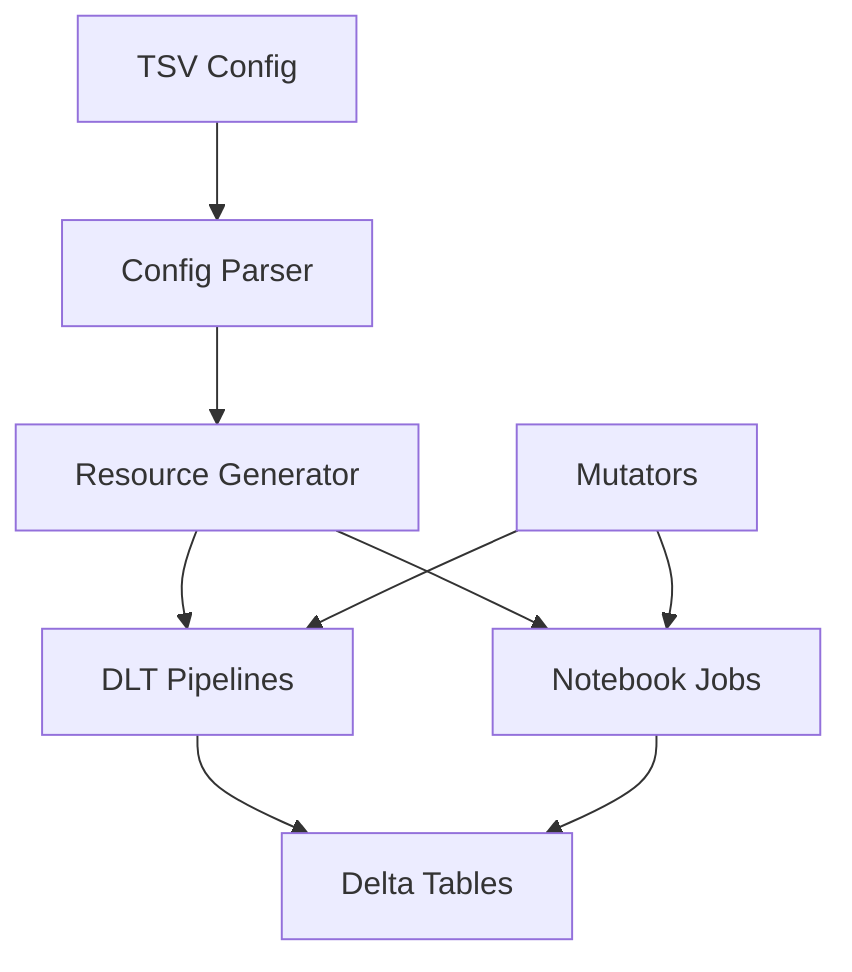

# Developer Guide

This guide is for developers who want to extend, modify, or contribute to the Azure Databricks Autoloader Framework.

## 🏗️ Architecture Overview

### Framework Components

```
autoloader-framework-pydab/
├── databricks.yml              # Bundle configuration
├── mutators.py                 # Job transformation logic
├── resources/
│   └── autoloader_jobs.py      # Resource generation logic
├── src/
│   ├── notebooks/              # DLT pipeline implementations
│   │   ├── autoloader_pipeline.py
│   │   ├── autoloader_grouped_pipeline.py
│   │   └── autoloader_notebook.py
│   └── utils/
│       └── config_parser.py    # TSV configuration parser
├── config/
│   └── ingestion_config.tsv    # Pipeline definitions
└── sample_data/                # Test data and examples
```

### Data Flow



## 🔧 Core Components

### 1. Configuration Parser (`src/utils/config_parser.py`)

**Purpose**: Validates and parses the TSV configuration file.

**Key Methods**:
- `load_config()`: Loads and validates TSV file
- `validate_config()`: Performs comprehensive validation
- `parse_autoloader_options()`: Parses JSON options

**Extension Points**:
```python
# Add new validation rules
def validate_custom_field(self, df: pd.DataFrame) -> List[str]:
    errors = []
    # Add your validation logic
    return errors

# Add new file format support
valid_formats = ['json', 'parquet', 'csv', 'avro', 'orc', 'delta']
```

### 2. Resource Generator (`resources/autoloader_jobs.py`)

**Purpose**: Generates Databricks resources (pipelines, jobs) from configuration.

**Key Classes**:
- `AutoloaderResourceGenerator`: Main resource generation logic
- `Pipeline`: DLT pipeline definitions
- `Job`: Traditional Databricks job definitions

**Key Methods**:
- `generate_resources()`: Main entry point
- `create_autoloader_pipeline()`: Single DLT pipeline creation
- `create_grouped_autoloader_pipeline()`: Grouped DLT pipeline creation
- `create_autoloader_job()`: Traditional job creation

**Extension Examples**:

#### Adding New Resource Types
```python
def create_custom_pipeline(self, config_row: pd.Series) -> CustomResource:
    """Create a custom resource type."""
    return CustomResource(
        name=f"custom_{config_row['pipeline_group']}",
        configuration=self._build_custom_config(config_row),
        # Add your custom resource properties
    )
```

#### Adding New Cluster Configurations
```python
def _get_cluster_config(self, cluster_size: str, cluster_config: str) -> dict:
    """Generate cluster configuration with new sizes."""
    if cluster_size == "xlarge":
        cluster_settings.update({
            "node_type_id": "Standard_D16s_v5",
            "autoscale": {
                "min_workers": 4,
                "max_workers": 10,
                "mode": "ENHANCED"
            }
        })
    # ... existing logic
```

### 3. Mutators (`mutators.py`)

**Purpose**: Transform Databricks jobs during deployment.

**Key Functions**:
- `add_default_cluster_config()`: Adds cluster configuration to jobs
- `add_monitoring_config()`: Adds monitoring and tagging

**Extension Examples**:

#### Adding Custom Job Transformations
```python
@job_mutator
def add_custom_config(job: Job) -> Job:
    """Add custom configuration to all jobs."""
    if job.tags is None:
        job.tags = {}
    
    job.tags.update({
        "custom_tag": "custom_value",
        "environment": "production"
    })
    
    return job
```

#### Adding Environment-Specific Logic
```python
@job_mutator  
def add_environment_config(job: Job) -> Job:
    """Add environment-specific configuration."""
    env = os.getenv("DATABRICKS_BUNDLE_TARGET", "dev")
    
    if env == "prod":
        # Production-specific configuration
        job.max_concurrent_runs = 1
        job.timeout_seconds = 3600
    else:
        # Development configuration
        job.max_concurrent_runs = 3
        job.timeout_seconds = 1800
    
    return job
```

### 4. DLT Notebooks (`src/notebooks/`)

**Purpose**: Implement the actual data processing logic.

#### `autoloader_pipeline.py`
- Single-table DLT pipeline
- Direct Auto Loader to Delta table processing
- Automatic schema inference

#### `autoloader_grouped_pipeline.py`  
- Multi-table DLT pipeline
- Processes multiple data sources in one pipeline
- Shared configuration and monitoring

#### `autoloader_notebook.py`
- Traditional Databricks job implementation
- More control over processing logic
- Custom error handling and retry logic

**Extension Examples**:

#### Adding Custom Data Transformations
```python
@dlt.table(
    name="transformed_data",
    comment="Custom transformed data"
)
def transform_data():
    """Apply custom transformations."""
    df = dlt.read("raw_data")
    
    # Add custom transformations
    df = df.withColumn("processed_timestamp", current_timestamp())
    df = df.withColumn("data_quality_score", calculate_quality_score(df))
    
    return df

def calculate_quality_score(df):
    """Custom data quality calculation."""
    # Implement your quality scoring logic
    return lit(0.95)  # Example score
```

#### Adding Data Quality Checks
```python
@dlt.expect_all_or_drop("valid_records")
@dlt.expect("valid_email", "email IS NOT NULL AND email LIKE '%@%'")
@dlt.expect("valid_timestamp", "created_at IS NOT NULL")
def quality_validated_data():
    """Data with quality validation."""
    return dlt.read("raw_data")
```

## 🔌 Extension Points

### 1. Adding New File Formats

#### Step 1: Update Configuration Parser
```python
# In src/utils/config_parser.py
valid_formats = ['json', 'parquet', 'csv', 'avro', 'orc', 'delta', 'xml']  # Add 'xml'
```

#### Step 2: Add Format-Specific Options
```python
# In src/notebooks/autoloader_pipeline.py
def get_format_options(file_format: str) -> dict:
    """Get format-specific Auto Loader options."""
    options = {}
    
    if file_format.lower() == "xml":
        options.update({
            "cloudFiles.rowTag": "record",
            "cloudFiles.attributePrefix": "_attr_",
            "cloudFiles.valueTag": "_value"
        })
    
    return options
```

#### Step 3: Update Documentation
Add the new format to configuration examples and troubleshooting guide.

### 2. Adding New Compute Options

#### Step 1: Update Cluster Configuration
```python
# In resources/autoloader_jobs.py
def _get_cluster_config(self, cluster_size: str, cluster_config: str) -> dict:
    """Generate cluster configuration."""
    
    if cluster_size == "gpu_small":
        cluster_settings.update({
            "node_type_id": "Standard_NC6s_v3",  # GPU instance
            "autoscale": {
                "min_workers": 1,
                "max_workers": 2,
                "mode": "ENHANCED"
            }
        })
```

#### Step 2: Update Validation
```python
# In src/utils/config_parser.py
valid_cluster_sizes = ['small', 'medium', 'large', 'serverless', 'gpu_small']
```

### 3. Adding Custom Monitoring

#### Step 1: Create Custom Metrics
```python
# In src/notebooks/autoloader_pipeline.py
def add_custom_metrics(df):
    """Add custom monitoring metrics."""
    
    # Record processing metrics
    row_count = df.count()
    spark.conf.set("custom.metrics.row_count", row_count)
    
    # Add custom columns for monitoring
    df = df.withColumn("processing_batch_id", lit(uuid.uuid4().hex))
    df = df.withColumn("data_source_quality", calculate_data_quality(df))
    
    return df
```

#### Step 2: Create Custom Alerts
```python
@job_mutator
def add_alerting_config(job: Job) -> Job:
    """Add custom alerting configuration."""
    
    # Add webhook notifications
    if job.webhook_notifications is None:
        job.webhook_notifications = WebhookNotifications()
    
    job.webhook_notifications.on_failure = [
        WebhookNotification(id="custom-alert-webhook")
    ]
    
    return job
```

### 4. Adding Custom Resource Types

#### Step 1: Define New Resource Class
```python
# In resources/autoloader_jobs.py
from databricks.sdk.service.ml import Model

def create_ml_model(self, config_row: pd.Series) -> Model:
    """Create ML model resource."""
    return Model(
        name=f"autoloader_model_{config_row['pipeline_group']}",
        description="Auto-generated model for data quality scoring"
    )
```

#### Step 2: Integrate with Resource Generation
```python
def generate_resources(self) -> tuple[List[Pipeline], List[Job], List[Model]]:
    """Generate all resources including custom types."""
    # ... existing logic ...
    
    models = []
    for idx, row in config_df.iterrows():
        if row.get('create_model', False):
            model = self.create_ml_model(row)
            models.append(model)
    
    return pipelines, jobs, models
```

## 🧪 Testing

### Unit Tests

```python
# tests/test_config_parser.py
import pytest
from src.utils.config_parser import ConfigParser

def test_valid_config():
    """Test configuration validation with valid data."""
    parser = ConfigParser("tests/fixtures/valid_config.tsv")
    df = parser.load_config()
    errors = parser.validate_config(df)
    assert len(errors) == 0

def test_invalid_source_type():
    """Test validation with invalid source type."""
    parser = ConfigParser("tests/fixtures/invalid_source.tsv")
    df = parser.load_config()
    errors = parser.validate_config(df)
    assert any("Invalid source types" in error for error in errors)
```

### Integration Tests

```python
# tests/test_resource_generation.py
def test_pipeline_generation():
    """Test DLT pipeline generation."""
    generator = AutoloaderResourceGenerator("tests/fixtures/test_config.tsv")
    pipelines, jobs = generator.generate_resources()
    
    assert len(pipelines) > 0
    assert all(p.name.startswith("autoloader_") for p in pipelines)
    assert all(p.edition == "ADVANCED" for p in pipelines)
```

### End-to-End Tests

```python
# tests/test_deployment.py
def test_bundle_deployment():
    """Test complete bundle deployment."""
    # This would require a test Databricks workspace
    result = subprocess.run([
        "databricks", "bundle", "validate", 
        "--profile", "test"
    ], capture_output=True)
    
    assert result.returncode == 0
```

## 🐛 Debugging

### Common Development Issues

#### 1. Bundle Validation Errors
```bash
# Check bundle syntax
databricks bundle validate --profile dev

# Inspect generated resources
databricks bundle summary --profile dev
```

#### 2. Resource Generation Issues
```python
# Add debug logging to resource generator
import logging
logging.basicConfig(level=logging.DEBUG)

# In autoloader_jobs.py
print(f"🔍 Processing row: {row.to_dict()}")
print(f"📋 Generated config: {pipeline_config}")
```

#### 3. Notebook Execution Issues
```python
# Add debug prints to notebooks
print(f"📊 DataFrame schema: {df.schema}")
print(f"🔢 Row count: {df.count()}")
print(f"⚙️ Read options: {read_options}")
```

### Debug Tools

#### Configuration Inspector
```python
# debug/inspect_config.py
from src.utils.config_parser import ConfigParser

def inspect_configuration():
    """Inspect and validate configuration."""
    parser = ConfigParser("config/ingestion_config.tsv")
    df = parser.load_config()
    
    print("📋 Configuration Summary:")
    print(f"  Rows: {len(df)}")
    print(f"  Columns: {list(df.columns)}")
    
    errors = parser.validate_config(df)
    if errors:
        print("❌ Validation Errors:")
        for error in errors:
            print(f"  - {error}")
    else:
        print("✅ Configuration is valid")

if __name__ == "__main__":
    inspect_configuration()
```

#### Resource Inspector
```python
# debug/inspect_resources.py
from resources.autoloader_jobs import AutoloaderResourceGenerator

def inspect_resources():
    """Inspect generated resources."""
    generator = AutoloaderResourceGenerator("config/ingestion_config.tsv")
    pipelines, jobs = generator.generate_resources()
    
    print(f"📊 Generated Resources:")
    print(f"  Pipelines: {len(pipelines)}")
    print(f"  Jobs: {len(jobs)}")
    
    for pipeline in pipelines:
        print(f"  Pipeline: {pipeline.name}")
        print(f"    Serverless: {pipeline.serverless}")
        print(f"    Continuous: {pipeline.continuous}")

if __name__ == "__main__":
    inspect_resources()
```

## 📚 Additional Resources

### Development Tools
- **[Databricks CLI](https://docs.databricks.com/azure/en/dev-tools/cli/index.html)** - Command-line interface
- **[Databricks SDK](https://docs.databricks.com/azure/en/dev-tools/sdk-python.html)** - Python SDK documentation
- **[Bundle Development](https://docs.databricks.com/azure/en/dev-tools/bundles/index.html)** - Asset bundle development guide

### API References
- **[Jobs API](https://docs.databricks.com/azure/en/dev-tools/api/latest/jobs.html)** - Jobs API reference
- **[Pipelines API](https://docs.databricks.com/azure/en/dev-tools/api/latest/pipelines.html)** - DLT Pipelines API reference
- **[Workspace API](https://docs.databricks.com/azure/en/dev-tools/api/latest/workspace.html)** - Workspace API reference

### Best Practices
- **[Code Organization](https://docs.databricks.com/azure/en/dev-tools/bundles/best-practices.html)** - Bundle organization best practices
- **[Version Control](https://docs.databricks.com/azure/en/repos/index.html)** - Git integration with Databricks
- **[CI/CD Patterns](https://docs.databricks.com/azure/en/dev-tools/bundles/deployment-patterns.html)** - Deployment automation patterns

---

## 🤝 Contributing Guidelines

1. **Follow Code Style**: Use Black for Python formatting
2. **Add Tests**: Include unit tests for new functionality  
3. **Update Documentation**: Update both user and developer docs
4. **Validate Changes**: Test with `databricks bundle validate`
5. **Performance**: Consider impact on bundle deployment time

## 📞 Getting Help

- **Framework Issues**: Create GitHub issues with detailed reproduction steps
- **Databricks Questions**: Use [Databricks Community](https://community.databricks.com/)
- **Azure Integration**: Refer to [Azure Databricks Documentation](https://docs.databricks.com/azure/)

---

**Happy coding! 🚀**
